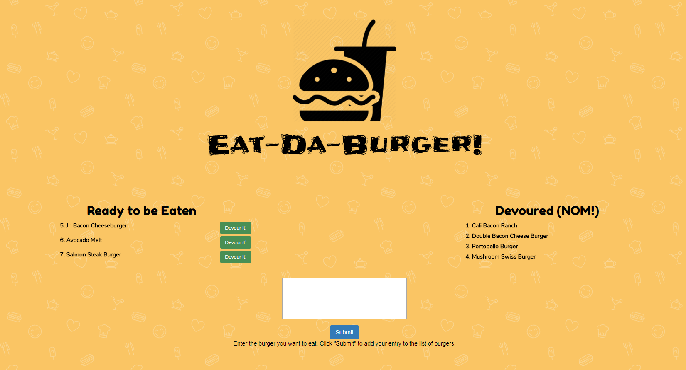

# burger
A full stack application that displays all burgers in a MySQL database, adds new burger data to the same database, and updates the eaten/not eaten status of a burger. Each change to the database initiates a page reload to show the changes. 

**Technology / Concepts used:** MySQL, Node.js, Express, Handlebars, MVC, ORM, JavaScript, and CSS.

- - -

Below is a screenshot of the application:
